

Data Mining을 이용한 서울대공원 입장객 수 예측 
============================

## 😷 Quick overview

#### **여러가지 데이터 마이닝 기법을 활용하여 서울대공원 입장객수에 영향을 미치는 요인을 찾고 2019년 4월의 입장객 수를 예측한다.**

1) **Brainstorming 을 통한 요인 선정**
> 환경적 요인 : 기온, 강수량, 미세먼지
> 외부적 요인 : 행사의 유무

2) **탐색적 데이터 분석(EDA) 진행 후, SPSS Modeler를 활용하여 각 요인과 입장객수의 관계에 대한 그래프 작성**
>  그래프로 월별, 요일 별 데이터의 변동을 살펴본다. 작성한 그래프로 NA값과 이상치를 확인하고, R을 이용하여 전처리한다.

3) **시계열 분석과 의사결정 나무를 이용한 예측**
>  동물원의 특성상 계절별, 요일별 등에 의한 트렌드가 있을 것이라 예상하였다. 
>  따라서 시계열분석을 이용하여 입장객수 예측 모형을 구축하고자 했다. 
>  이때, 시간 간격은 월별, 요일별로 예측 및 시각화 한다.
>  또한, 의사결정나무를 통해 가장 큰 영향을 미치는 변수를 파악할 뿐만 아니라, 어떤 조건하에서 어떤 변수가 요인으로 작용하는지 살펴보았다.
>  
4) **이후 시계열 분석과 Decision Tree 분석 결과를 통합하여 최종적으로 요인에 따라 입장객수를 예측한 후 매월 예상 입장객 수를 나타내는 예측표 작성**

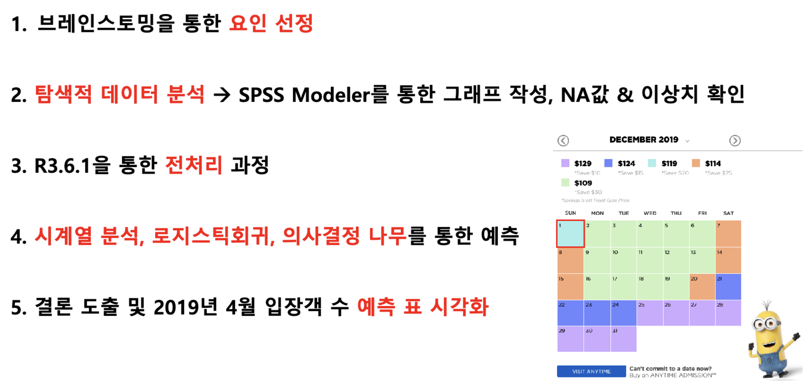

- 자세한 내용은 아래 최종 발표 자료를 참고해주세요

  
## 💁🏻‍♀️ 발표 자료

- 최종 발표 자료 ([link](https://github.com/hanakim120/grandpark-seoul-data-mining/blob/main/%E1%84%89%E1%85%A5%E1%84%8B%E1%85%AE%E1%86%AF%E1%84%83%E1%85%A2%E1%84%80%E1%85%A9%E1%86%BC%E1%84%8B%E1%85%AF%E1%86%AB%20%E1%84%8B%E1%85%B5%E1%84%8B%E1%85%AD%E1%86%BC%E1%84%80%E1%85%A2%E1%86%A8%20%E1%84%8B%E1%85%A8%E1%84%8E%E1%85%B3%E1%86%A8%20project.pdf))

  
## 사용한 데이터

###  Raw 데이터 수집 경로 및 Attribute 목록

-   서울대공원 입장객수 데이터 ([서울 열린 데이터 광장](https://data.seoul.go.kr/dataList/datasetView.do?infId=OA-15386&srvType=F&serviceKind=1&currentPageNo=1))
	: 2009년 1월 1일~2019년 4월 30일 일별 데이터
	- 데이터개수: 약 220000개
    - 특이 사항 : 2011년 1월1일 ~ 1월24일, 2014년 2월1일 ~ 2014년 2월28일, 2017년 1월1일 ~ 2월28일, 2017년 3월1일 ~ 3월27일에 해당하는 data 없음)

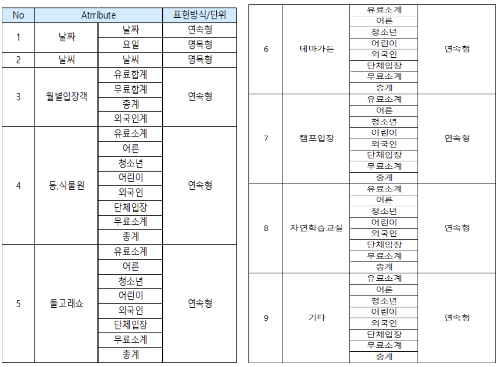

-   기온 데이터 ([기상자료개방포털](https://data.kma.go.kr/climate/RankState/selectRankStatisticsDivisionList.do?pgmNo=179))
	: 2009년 1월 1일~2019년 11월 18일 일별 데이터
	- 데이터 개수: 약 39000개

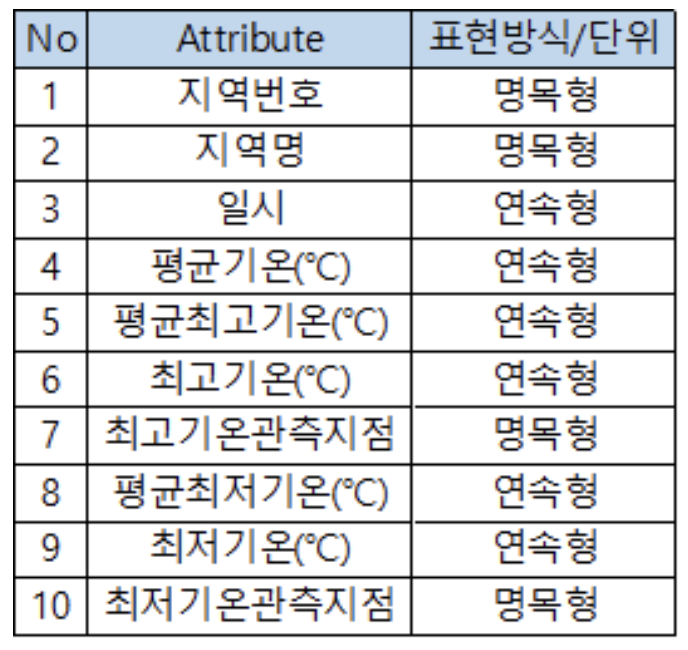

-   강수량 데이터 ([기상자료개방포털](https://data.kma.go.kr/climate/RankState/selectRankStatisticsDivisionList.do?pgmNo=179))
	: 2009년 1월 1일~2019년 11월 18일 일별 데이터
	- 데이터 개수: 약 31200개

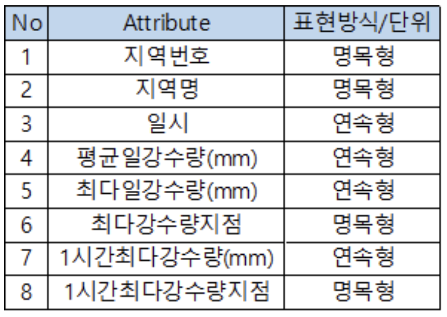

-   미세먼지/초미세먼지 데이터 ([에어코리아](https://www.airkorea.or.kr/web/pmWarning?pMENU_NO=115))
	: 2015년 1월 1일~2019년 11월 3일 일별 데이터
	- 데이터 개수: 약 800개

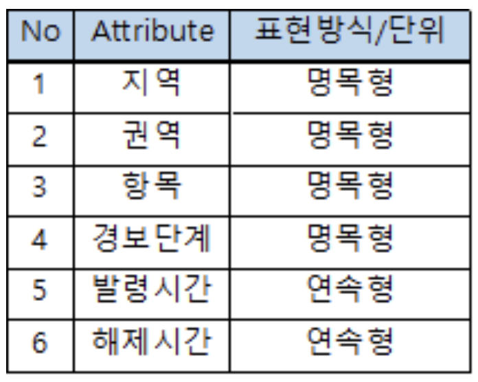

-   서울대공원 행사 데이터 ([서울시 120 다산콜센터 네이버 블로그](https://blog.naver.com/120seoulcall))
	    : 2009년 1월 1일~2019년 11월 21일 일별 데이터
	   - 데이터 개수: 약 4574개

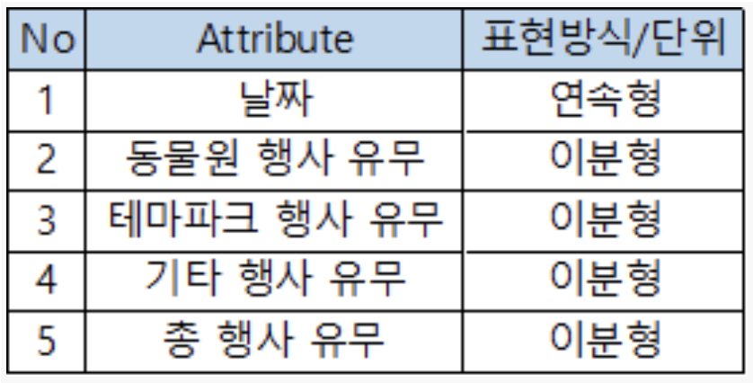

  

## EDA & Data preprocessing
1. 데이터를 살펴보고 결측값 13,618개 (전체의 13%) 처리
- 결측값이 전체 데이터의 높은 비율을 차지하고 있어 데이터를 삭제하는 방법이 아닌 전년도와 이듬해 같은 날짜의 데이터 두 쌍을 평균을 내어 채워 넣는 방법 선택

2. 그래프를 통해 시각화 한 결과 눈에 띄는 이상치 제거의 필요성

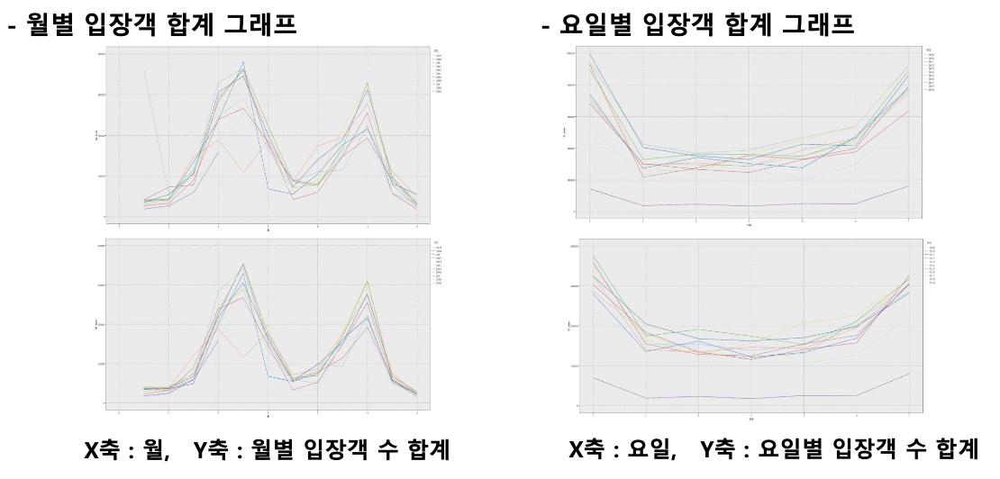

- Boxplot 을 이용하여 최소값과 최대값을 넘어가는 위치의 값 제거

## Skills
- R
- SPSS Moduler

## Data analysis
### 1. 시계열 분석

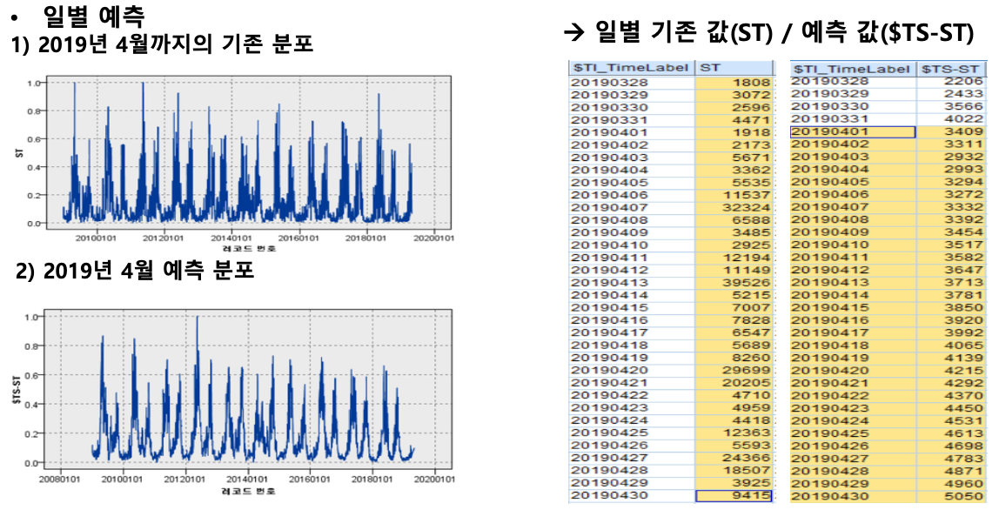

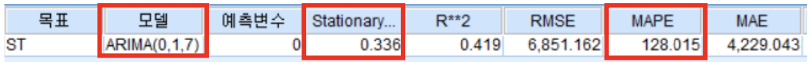

### 2. Logistic Regression

### 3. Decision Tree
(1) C 5.0 모델

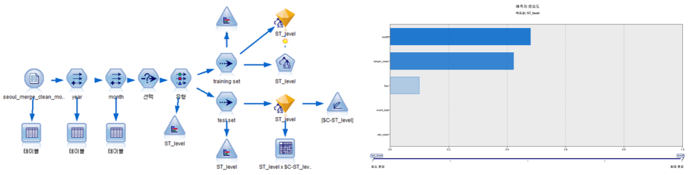

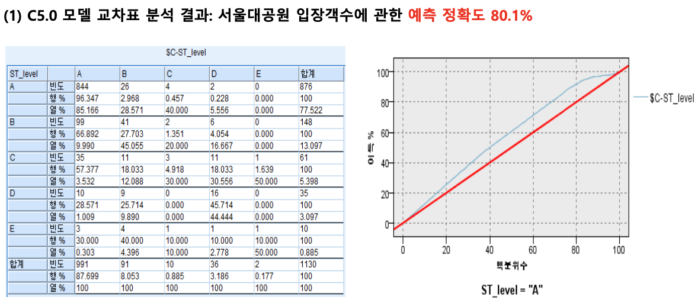

(2) CHAID 모델

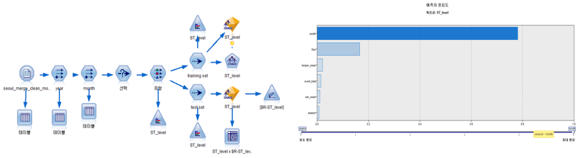

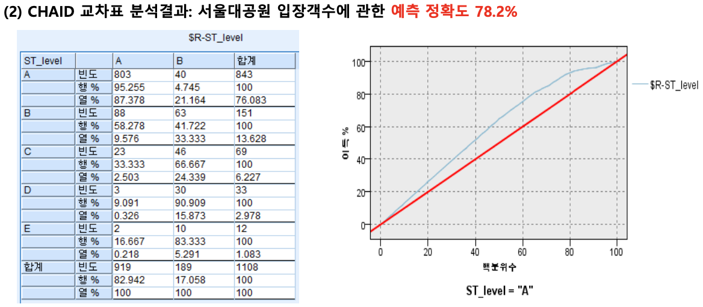

(3) CART 모델

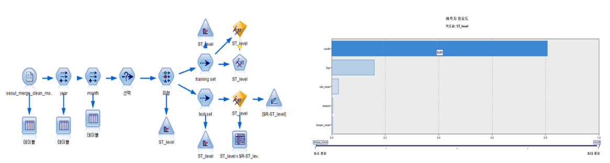

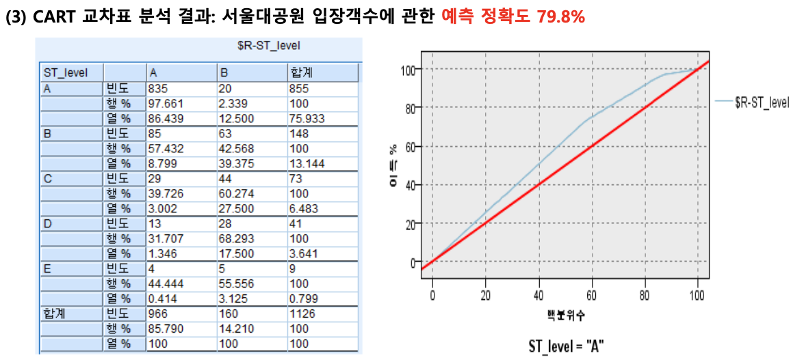

  

## Results 

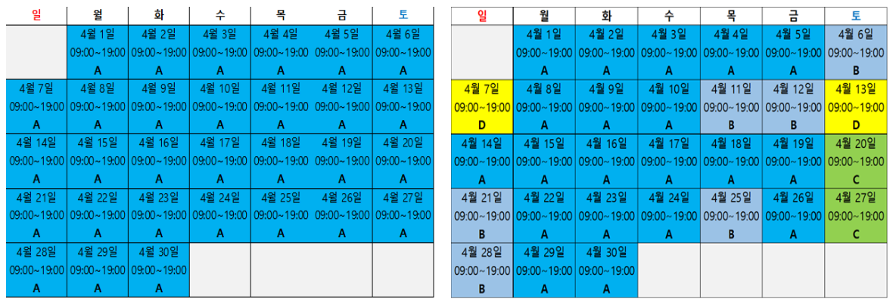

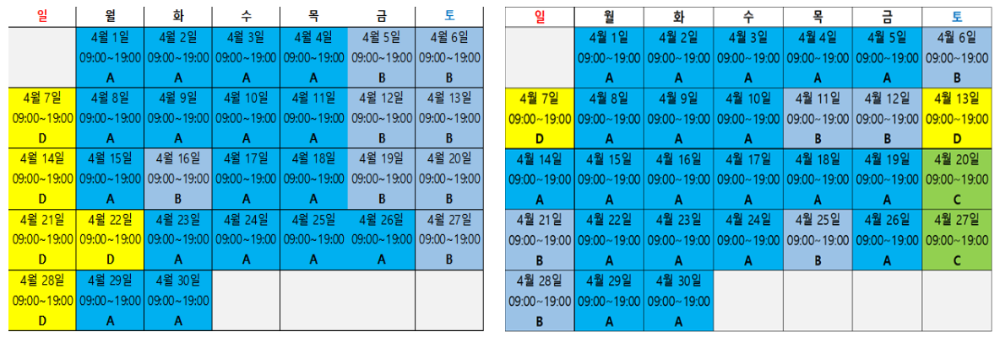

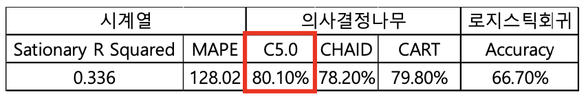

## Paper References

-   숲유형 데이터를 이용한 분류모형 간 비교 연구: 판별분석, 로지스틱 회귀, 신경망, 의사결정나무를 중심으로, 김정화, 2012
    
-   의사결정나무와 신경망모형 결합에 의한 운전자 우회결정요인분석, 강진

  
## License

)

- Copyright © [Hana Kim](https://github.com/hanakim120).
